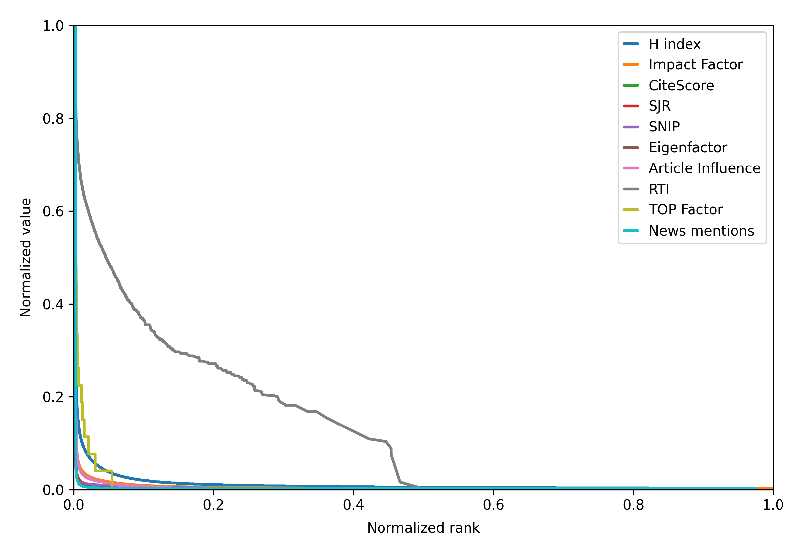
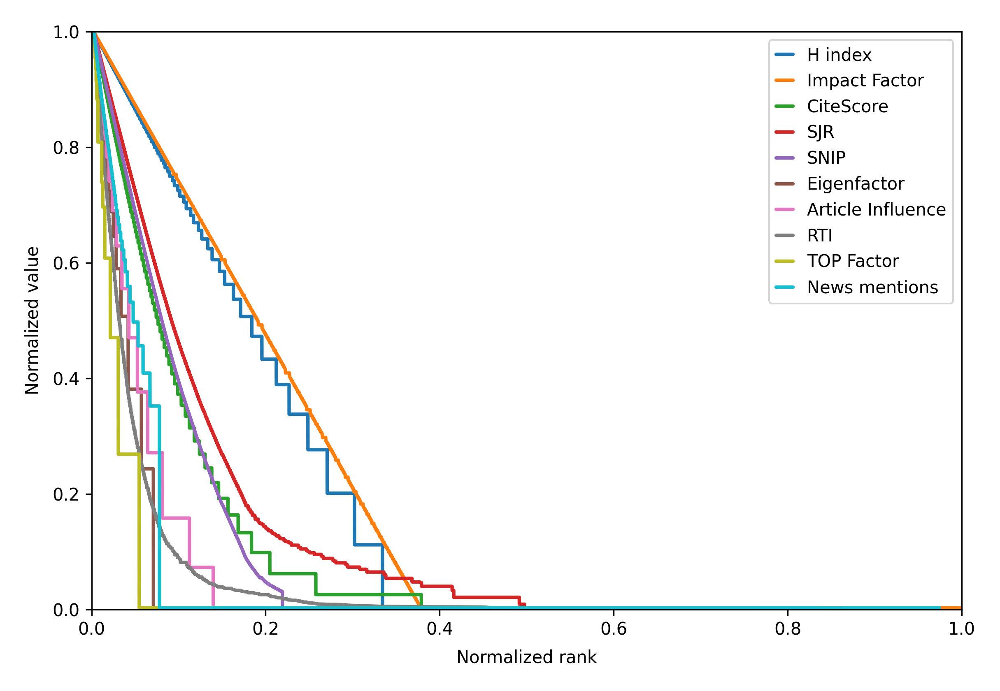
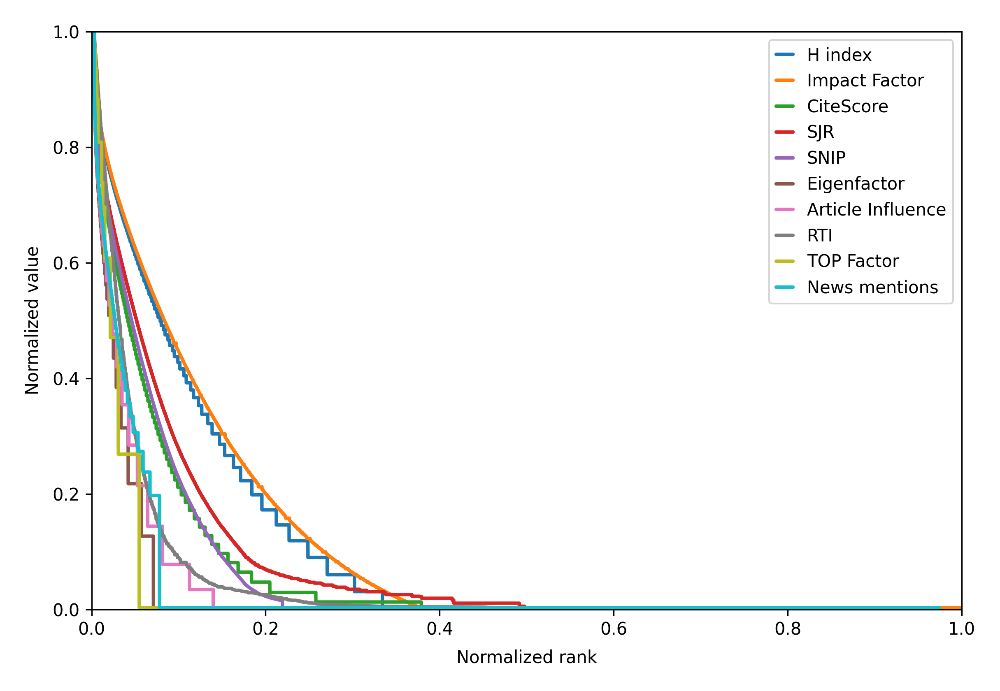
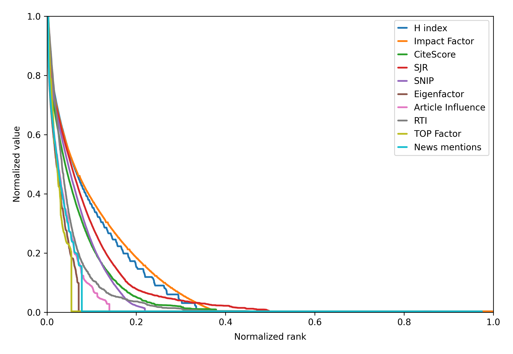
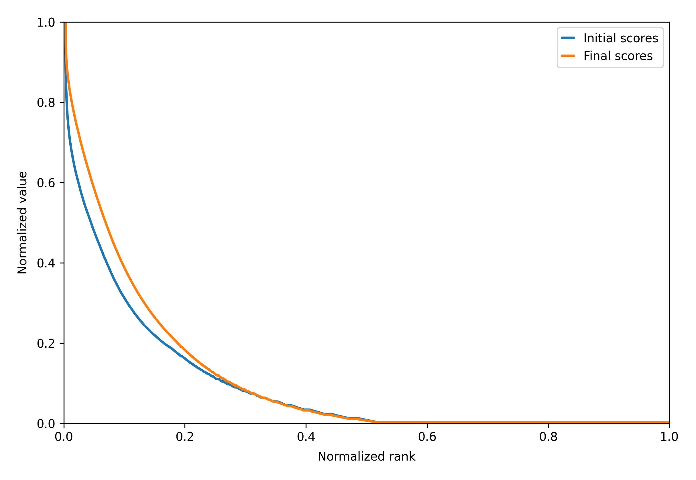

# 📚 Papermap Data

 

This repository contains the code to generate the **[Papermap](https://github.com/angeluriot/Papermap)** journals database and compute their `Papermap Journal Score`.

 

# 📋 Summary

* **[📋 Summary](#-summary)**
* **[🗃️ Data](#%EF%B8%8F-data)**
* **[📊 Metrics](#-metrics)**
* **[🧮 Score](#-score)**
* **[🏆 Results](#-results)**

 

# 🗃️ Data

The initial journals data is retrieved from the **[OpenAlex](https://openalex.org/)** database to create a list of 209,819 journals available in the **[/data/journals.jsonl](/data/journals.jsonl)** file.

 

# 📊 Metrics

To create the least biased score possible, all publicly available metrics about scientific journals were included:

### Metrics based on citations

* **[H-Index](https://www.scimagojr.com/journalrank.php?order=h&ord=desc)**: the maximum value of H such that the journal has published H papers that have each been cited at least H times (from **[OpenAlex](https://openalex.org/)** and **[SCImago](https://www.scimagojr.com)**)

* **[Impact Factor](https://www.scimagojr.com/journalrank.php?order=cpd&ord=desc)**: the average number of citations received this year by papers published in the journal during the last 2 years (from **[OpenAlex](https://openalex.org/)** and **[SCImago](https://www.scimagojr.com)**)

* **[CiteScore](https://www.scopus.com/sources.uri)**: the average number of citations received in the last 4 years by papers published in the journal during the same period (from **[Scopus](https://www.elsevier.com/products/scopus)**)

* **[SCImago Journal Rank](https://www.scimagojr.com/journalrank.php)**: the average number of weighted citations received this year by papers published in the journal during the last 3 years (from **[SCImago](https://www.scimagojr.com)** and **[Scopus](https://www.elsevier.com/products/scopus)**)

* **[Source Normalized Impact per Paper](https://www.journalindicators.com/indicators)**: the average number of citations received in the last 3 years by papers published in the journal during the same period weighted by differences in citation practices between subject fields (from **[CWTS](https://www.journalindicators.com)** and **[Scopus](https://www.elsevier.com/products/scopus)**)

* **[Eigenfactor Score](http://www.eigenfactor.org/projects/journalRank/rankings.php?bsearch=2015&searchby=year&orderby=eigenfactor)**: the percentage of time spent visiting the journal when randomly following citation links from papers published in the last 5 years (from **[Eigenfactor](http://www.eigenfactor.org/)**)

* **[Article Influence Score](http://www.eigenfactor.org/projects/journalRank/rankings.php?bsearch=2015&searchby=year&orderby=articleinfluence)**: the **Eigenfactor Score** divided by the number of papers published in the journal in the last 5 years (from **[Eigenfactor](http://www.eigenfactor.org/)**)

* **[Self-citation rate](https://www.journalindicators.com/indicators)**: the percentage of citations to the journal that come from the journal itself (from **[CWTS](https://www.journalindicators.com)**)

### Metrics based on quality criteria

* **[Rigor & Transparency Index](https://sciscore.com/rti)**: the average **SciScore** for the journal's papers, reflecting how well they adhere to criteria such as randomization, blinding, power, transparency, and more (from **[SciScore](https://sciscore.com)**)

* **[Transparency and Openness Promotion Factor](https://topfactor.org/journals)**: a rating of journal policies assessing how strongly they promote transparency and reproducibility (from **[TOP Factor](https://topfactor.org)**)

### Metrics based on influence outside academia

* **[News mentions](https://lookerstudio.google.com/reporting/bf225056-5331-44ac-a9c8-ed75c745dce2/page/4RByC)**: the average number of news mentions of the journal's papers (from **[Altmetric](https://www.altmetric.com)**)

All the metrics are stored in the **[/data/journals.jsonl](/data/journals.jsonl)** file, run the **[/data.ipynb](/data.ipynb)** notebook to update it.

 

# 🧮 Score

The naive way to calculate a score would be to take the average of all these metrics, but this would be biased towards the ones with the highest values. A simple solution would be to normalize them before averaging (between 0 and 1 for example), but their distributions are still very different:

	

Moreover, the metrics based on citations or mentions have a highly exponential distribution that crushes most of the values to almost zero.

To solve this, all the metric values are first replaced by their rank in the list of journals (normalized so the best journal has a rank of 1 and the worst a rank of 0):

	

But now the opposite problem arises, this new distribution is too linear and doesn't reflect the real differences between the journals (the difference between the 1st and the 10,000th journal is not the same as between the 10,000th and the 20,000th). To correct this, a transformation is used to make the distribution more exponential, it's applied to the ranks of the metrics that are based on citations or mentions (keeping the others linear):

	

Finally, a warning often seen on the websites of these metrics is that they should not be compared between different fields of research. To take this into account, the same calculations are made for each field separately, and for each journal, the average of its scores in all its fields is taken and merged with its global score:

	

When averaging the metrics to create the final score, an important point is missing data, some journals have no value for some metrics. To avoid cases where a journal gets a really high score based on a single metric, a penalty is added to the denominator of the average for each missing metric.

The distribution of the final scores is falling a little too fast. To correct this, the same steps as described above (ranking + transformation) are also implemented, but here the result is combined with the initial score instead of replacing it:

	

The code that implements all these calculations is available in the **[/scores.py](/scores.py)** file.

The final scores are stored in the **[/journals/data.jsonl](/journals/data.jsonl)** file, run the **[/scores.ipynb](/scores.ipynb)** notebook to update it.

 

# 🏆 Results

Here are the top 10 journals based on their `Papermap Journal Score`:

<table>
	<thead>
		<tr>
			<th align="center">Rank</th>
			<th align="center">Journal</th>
			<th align="center">Papermap Journal Score</th>
		</tr>
	</thead>
	<tbody>
		<tr>
			<td align="center">1</td>
			<th align="left"><a href="https://www.nature.com">Nature</a></th>
			<td align="center">0.981</td>
		</tr>
		<tr>
			<td align="center">2</td>
			<th align="left"><a href="https://www.nejm.org/">New England Journal of Medicine</a></th>
			<td align="center">0.974</td>
		</tr>
		<tr>
			<td align="center">3</td>
			<th align="left"><a href="https://www.cell.com/cell/home">Cell</a></th>
			<td align="center">0.974</td>
		</tr>
		<tr>
			<td align="center">4</td>
			<th align="left"><a href="https://acsjournals.onlinelibrary.wiley.com/journal/15424863">CA: A Cancer Journal for Clinicians</a></th>
			<td align="center">0.971</td>
		</tr>
		<tr>
			<td align="center">5</td>
			<th align="left"><a href="https://www.thelancet.com/journals/lancet/home">The Lancet</a></th>
			<td align="center">0.960</td>
		</tr>
		<tr>
			<td align="center">6</td>
			<th align="left"><a href="https://www.nature.com/nm/">Nature Medicine</a></th>
			<td align="center">0.959</td>
		</tr>
		<tr>
			<td align="center">7</td>
			<th align="left"><a href="https://www.cell.com/immunity/home">Immunity</a></th>
			<td align="center">0.958</td>
		</tr>
		<tr>
			<td align="center">8</td>
			<th align="left"><a href="https://www.cell.com/cancer-cell/home">Cancer Cell</a></th>
			<td align="center">0.958</td>
		</tr>
		<tr>
			<td align="center">9</td>
			<th align="left"><a href="https://www.nature.com/nbt/">Nature Biotechnology</a></th>
			<td align="center">0.956</td>
		</tr>
		<tr>
			<td align="center">10</td>
			<th align="left"><a href="https://www.science.org/journal/science">Science</a></th>
			<td align="center">0.956</td>
		</tr>
	</tbody>
</table>
